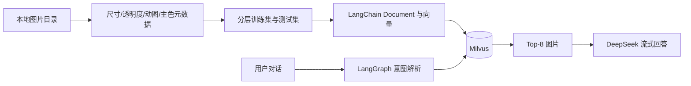

<div align="center">
    
    <div>
        <a href="README.md" target="_blank">中文</a> | <a href="README_EN.md" target="_blank">English</a>
    </div>
   	<br />
    <div>
        
        
        <br>
        
        <br>
        
        
    </div>
    <h1 style="margin: 10px">
        <a href="https://github.com/theOnlyUnique/IMGM" target="_blank">IMGM</a>
    </h1>
    <p>通用的桌面图片管理工具</p>
</div>

# 1.项目初衷 ⛵

现在社交媒体平台越来越多，社交软件除了 QQ 之外，还有微信、抖音、小红书还有一大批平台,每个平台都有自己的表情收藏,如果想在 A 平台用 B 平台的表情,这可能是很难的事情,所以作者就在想,如果可以将自己的表情包收藏到自己本地,然后建立一个图片检索工具,对存储文件的路径进行检索,做到模糊匹配和快速复制的功能,那么我们聊天发表情包将会非常迅速,而且可以不受平台限制.

基于以上设想,该项目应运而生.我把他叫做 IMGM,即图片(IMG)管理器(management).

> PS:本项目代码开源,绝对不会泄露您的个人图片,请您放心使用!虽然目前可能做的很烂,但是我会持续进行优化.

# 2.项目技术栈 🛠

由于要跨端开发,最终选用`electorn 33.0.2`进行开发,而且不想基于框架进行构建,所以选择了原生 js,跟着官网手撸项目

打包工具使用的是`electron-forge`的脚手架

存储方面,尝试过`electron-localStorage`,但是发现打包后存储会失效,于是采用的`electron-store 8.1.0`,注意一定要用这个版本,如果升级到最新版本,将不能使用 require 引入,将会报错!

弹窗组件使用的是`notyf 3.10.0`,非常轻量级而且美观
开发时 node 版本为 18.18.2，可直接 npm 下载使用

# 3.本地运行 👉

首先拉取项目

```bash
git clone https://github.com/theOnlyUnique/IMGM.git
```

然后切入到项目

```bash
cd IMGM
```

安装依赖(项目中已设置依赖对应镜像地址)

```bash
npm i
```

如果安装缓慢或者失败,可以,

首先全局安装 cnpm

```bash
npm i cnpm -g
```

然后使用 cnpm 安装依赖

```bash
cnpm i
```

启动项目

```bash
npm run start
```

打包改项目(该步骤已封装好)

```bash
npm run bingo
```

> 如果该指令失败，请直接使用npm run make进行打包

# 4.项目基础使用 🤓

> PS:首先你需要准备好一些图片素材!!!

进入首页,你会看到如下界面:(理论上啥也没有应该是加载你的用户图片文件夹)


首先点击选择文件夹按钮,选取你存放图片的目标文件夹


选择完毕后扫描路径将显示你刚才选取的路径,然后点击开始搜索,应用将对你所选目录进行扫描,选取所有的图片资源(jpg,jpeg,png,gif 四种类型)


扫描完成后点击确定,然后点击刷新图片即可开始查看目标文件夹下的图片资源了,您可以对他们进行重命名和快速复制


# 5.RIR拓展模块

RIR(Remote image retrieval),是一种基于IMGM项目开发出的新的远程图片检索方式，通过约定特殊的JS文件格式，来指定远程文件存放的位置，便于快速复制远程网络图片。只要您遵守该RIR约定，那么就可以使用本程序快速索引您自定义的RIR远程资源。

> 后续将开发快速建立RIR远程图片地址的功能模块，敬请期待！

## 5.1基础使用

输入建立好的RIR远程地址，然后点击搜索，如果解析成功即可自动获取RIR远程图片。建议不要开启“禁用缓存”功能，这样可以利用您的本地强缓存来加快您的图片加载速度！


## 5.2RIR手动建站

目前RIR由RIR文件和RIR资源两部分组成。作者通过暴露RIR文件以给出RIR资源列表及其存放位置，方便我们的程序直接按照分页对远程图片进行解析和获取。

该RIR部分JS文件由以下python脚本生成：

```python
import os
import json

def scan_images_recursive(folder_path, output_js_file="image_list.js"):
    """
    递归扫描文件夹及子文件夹下的图片文件，生成 JS 列表
    :param folder_path: 要扫描的根目录
    :param output_js_file: 输出的 JS 文件名（默认：image_list.js）
    """
    # 支持的图片扩展名
    image_extensions = ('.jpg', '.jpeg', '.png', '.gif', '.webp', '.bmp')
    
    image_files = []
    
    # 递归遍历所有子目录
    for root, _, files in os.walk(folder_path):
        for filename in files:
            if filename.lower().endswith(image_extensions):
                # 获取相对路径（相对于扫描的根目录）
                relative_path = os.path.relpath(os.path.join(root, filename), folder_path)
                # 替换 Windows 反斜杠为正斜杠（确保路径在 JS 中可用）
                relative_path = relative_path.replace("\\", "/")
                image_files.append(relative_path)
    
    # 按路径排序（可选）
    image_files.sort()
    result = {}
    result['list'] = image_files
    result['target'] = "https://www.qidong.tech:5173/resource/pic/"
    # 生成 JS 代码
    js_code = f"const rir_result = {json.dumps(result, indent=2, ensure_ascii=False)};\n"
    js_code += "export default rir_result;"
    
    # 写入 JS 文件
    with open(output_js_file, "w", encoding="utf-8") as f:
        f.write(js_code)
    
    print(f"✅ 已生成 {output_js_file}，包含 {len(result['list'])} 张图片（递归扫描）。")

if __name__ == "__main__":
    # 示例用法
    folder_to_scan = "./"  # 替换为你的目标文件夹
    scan_images_recursive(folder_to_scan)
```

首先，将该脚本放在资源根目录，并且使用nginx转发该目录。

然后，您可以修改result['target']变量以改变RIR资源地址。

你也可以修改rir_result为其他名字，作为JS文件导出的变量名称。

最后，您应该执行该Python脚本，其将默认生成image_list.js在根目录，一同被您的nginx所转发。

现在您就可以使用该JS文件的访问目录在IMGM平台上进行使用啦！🎉🎉🎉

> 本项目示例访问RIR文件地址，欢迎尝试喵：
>
> https://www.qidong.tech:5173/resource/pic/image_list.js

# 6.AI 图片 RAG 检索

项目右侧新增 AI 图片助手。用户可以连续聊天，LangGraph 会依次解析检索意图、从 Milvus 取回 Top-8 图片，再由 DeepSeek 结合结果流式回答。



## 6.1 环境准备

1. 安装并启动 Docker Desktop。
2. 复制 `.env.example` 为 `.env`，填写 `DEEPSEEK_API_KEY`；不要提交真实密钥。
3. 启动 Milvus：

```bash
npm run milvus:start
```

默认连接 `localhost:19530`，集合名为 `imgm_images_v1`。可在 `.env` 中通过 `MILVUS_ADDRESS` 和 `MILVUS_COLLECTION` 覆盖。

发布版不会把 `.env` 打进 ASAR。使用打包后的程序时，请把配置好的 `.env` 放在 `imgm.exe` 同目录；密钥始终保持为外置文件。

## 6.2 生成并索引数据集

任务指定目录可直接使用默认命令；也可以在参数中传入其他图片目录和输出目录。

```bash
# 默认扫描 C:\Users\lqd\Pictures\人物头像
npm run dataset:prepare

# 自定义目录
npm run dataset:prepare -- "D:\Pictures" "data\dataset"

# 重建 Milvus 集合并写入全量数据
npm run dataset:index
```

元数据包含目录类别、人工核验语义标签、文件名、格式、尺寸、横竖构图、动图、透明背景、主色与训练/测试标记。生成文件位于 `data/dataset`，Milvus 持久化数据位于 `data/milvus`，二者均不进入 Git。

## 6.3 检索评测

```bash
npm run eval:retrieval
```

当前数据集共 7,375 张图片，按类别分层切分为训练集 5,897 张、测试集 1,478 张。69 条自然语言测试查询的 Precision@8 为 100%，通过 `>95%` 的验收目标。训练样本不足 8 张的类别不计入该指标，详情见 [检索评测报告](artifacts/evaluation/retrieval-evaluation.md)。

## 6.4 常用命令

| 命令 | 作用 |
| --- | --- |
| `npm test` | 构建并运行单元测试 |
| `npm run milvus:status` | 查看 Milvus 健康状态 |
| `npm run milvus:stop` | 停止 Milvus，保留数据 |
| `npm run dataset:prepare` | 提取图片元数据并分层切分 |
| `npm run dataset:index` | 重建并填充 Milvus 图片集合 |
| `npm run eval:retrieval` | 计算并输出 Precision@8 |
| `npm start` | 启动 Electron 应用 |

# 参考资料📚

环境配置：<br>
https://blog.csdn.net/C_hawthorn/article/details/136072703<br>
https://blog.csdn.net/qq_38463737/article/details/140277803<br>
参考文章：<br>
https://blog.csdn.net/qq_37779709/article/details/81633502<br>
入门文章：<br>
https://blog.csdn.net/weixin_50216991/article/details/124188494<br>
打包指引：<br>
https://blog.csdn.net/ZYS10000/article/details/134913618<br>

# 项目文件说明🕮

| 序号 |   文件名    |         作用          |
| :--: | :---------: | :-------------------: |
|  1   | index.html  |     项目入口文件      |
|  2   |   main.js   |     程序代码入口      |
|  3   | preload.js  | 预加载脚本，写 IPC 的 |
|  4   |   dom.js    |     dom 相关操作      |
|  5   | renderer.js |       写着玩玩        |

# 项目指令说明🕮

| 序号 |          文件名           |                           作用                            |
| :--: | :-----------------------: | :-------------------------------------------------------: |
|  1   |           npm i           | 下载依赖 如果安装失败，<br>可以尝试全局安装 cnpm 然后安装 |
|  2   |       npm i cnpm -g       |                       全局安装 cnpm                       |
|  3   |         npm start         |                         启动项目                          |
|  4   | npx electron-forge import |                     导入项目到 Forge                      |
|  5   |       npm run make        |                     打包成可发布版本                      |

# 功能预告📢

- [ ] 上线标签管理功能
- [x] UI 美化(基础样式,窗口工具栏调整,窗口行为调整)
- [ ] 打包优化
- [x] 模糊搜索算法优化,深度递归逻辑优化
- [x] 多平台的测试优化
- [x] RIR建站引导模块

# 问题记录📝

1.当主线程需要消耗 CPU 干密集型任务的时候，会导致程序卡顿，想办法解决？？<br>

网上的解决方法貌似是，额外开一个线程，让这个线程去干活<br>

https://zhuanlan.zhihu.com/p/37050595?edition=yidianzixun<br>

2.当前粘贴板 API 不支持粘贴 GIF，如何解决这个问题呢？？？？？<br>

https://developer.mozilla.org/zh-CN/docs/Web/API/Clipboard/write<br>

受该[思路](https://deepinout.com/html/html-questions/301_html_javascript_copy_element_to_clipboard_with_all_styles.html#google_vignette)的启发，已解决。
