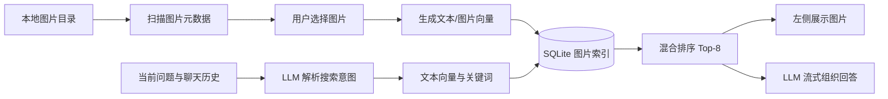

<div align="center">
    
    <div>
        <a href="README.md" target="_blank">中文</a>
    </div>
    <br />
    <div>
        
        
        
        <br>
        
    </div>
    <h1 style="margin: 10px">
        <a href="https://github.com/Kydon-ai/IMGM" target="_blank">IMGM</a>
    </h1>
    <p>通用的桌面图片管理工具</p>
</div>

# 1.项目初衷 ⛵

现在社交媒体平台越来越多，社交软件除了 QQ 之外，还有微信、抖音、小红书以及一大批平台。每个平台都有自己的表情收藏，如果想在 A 平台使用 B 平台的表情，通常需要在多个软件之间反复查找和保存。

IMGM 的目标是把图片素材保存在用户自己的电脑上，再通过目录扫描、文件名搜索和 AI 语义检索快速找到目标图片，并将图片复制到剪贴板。这样可以减少跨平台寻找图片的时间，也不需要把本地图片库上传到第三方服务。

IMGM 目前包含2个相互独立的使用场景：

- **本地图片库**：扫描本机目录，按文件名进行模糊搜索、分页浏览和复制。并且可自行配置LLM API激活AI助手，根据本地图片建立的文本向量和视觉向量，通过自然语言进行混合检索。
- **远程 RIR**：读取用户提供的远程 JavaScript 图片清单，浏览和复制远程图片；RIR 不使用本地图片库的列表和缓存。


## 1.1 数据和隐私说明

- 图片扫描和图片向量生成都在本地完成，并且使用嵌入向量进行比对，不会上传图片到LLM服务商。
- SQLite 数据库、图片目录和模型缓存默认保存在本地 `data/`。
- AI 检索时，用户的当前问题和必要的聊天历史会发送给设置中的 LLM 供应商，用于解析搜索意图和组织回答；。

# 2.项目技术栈 🛠

项目使用 Electron 构建桌面应用，主要技术如下：

| 技术 | 用途 |
| --- | --- |
| Electron 33.0.2 | 桌面窗口、主进程和系统能力 |
| TypeScript | 主进程、预加载脚本、DOM 逻辑和 AI 模块 |
| 原生 HTML/CSS/DOM | 界面结构和交互，不依赖大型前端框架 |
| `electron-store` | 保存本地界面、RIR、搜索历史和设置 |
| `better-sqlite3` | 保存图片索引和向量，并提供本地检索 |
| Transformers.js | 运行文本、图片和中文分词模型 |
| LangChain / LangGraph | 编排 AI 图片检索流程 |
| DeepSeek 或 OpenAI 兼容接口 | 解析用户意图和生成聊天回答 |
| electron-builder | 生成 Windows、Linux 和 macOS 发布包 |

源码位于 `src/`，通过 TypeScript 编译到 `dist/` 后运行。由 `electron-builder`进行发包。

开发和 CI 使用 Node.js 22 或更高版本。由于 `better-sqlite3`、`sharp` 等依赖包含原生模块，项目会在启动、测试和 CI 打包阶段检查或重新编译它们，使其匹配 Electron 的 ABI 版本。

# 3.本地运行 👉
## 3.1 环境要求
**客户端**使用环境：
如果你只是用户，需要准备这些。
1. Windows 或 Linux 操作系统。
2. 一些用于测试的图片素材。如果你不想手动重命名图片，可以采用该[图片语义重命名SKILL](https://skillhub.cn/skills/user_7c408d5e/image-semantic-renamer)让你的Agent自动重命名素材，以提升检索精度
3. 如果使用 AI 功能，需要一个可用的 LLM API 配置。

> 客户端请直接前往[Release界面](https://github.com/Kydon-ai/IMGM/releases)下载最新的安装包！！

**开发**环境：
如果你是开发者，开始前请额外准备环境：

1. Git。
2. Node.js 22 或更高版本，并确认 `node`、`npm` 可以在终端使用。

## 3.2 获取项目并安装依赖

拉取项目：

```bash
git clone https://github.com/Kydon-ai/IMGM.git
cd IMGM
```

按照锁定版本安装依赖：

```bash
npm ci
```

如果只是日常开发，也可以使用：

```bash
npm install
```

## 3.3 配置环境变量

复制示例配置文件：

Windows PowerShell：

```powershell
Copy-Item .env.example .env
```

macOS/Linux：

```bash
cp .env.example .env
```

`.env` 中常用配置如下：

| 配置项 | 默认值 | 作用 |
| --- | --- | --- |
| `DEEPSEEK_API_KEY` | 空 | DeepSeek API 密钥，CLI/MCP 使用，必须在设置中填写 |
| `DEEPSEEK_MODEL_NAME` | `deepseek-chat` | 默认聊天模型 |
| `DEEPSEEK_BASE_URL` | `https://api.deepseek.com` | LLM API 根地址 |
| `IMAGE_DB_PATH` | `./data/app.db` | 图片 SQLite 数据库路径 |
| `IMAGE_MODEL_CACHE_DIR` | `./data/models` | Transformers.js 模型缓存目录 |
| `TEXT_MODEL_ID` | `aurantium/clip-ViT-B-32-multilingual-v1` | 文本向量模型 |
| `IMAGE_MODEL_ID` | `Xenova/clip-vit-base-patch32` | 图片视觉向量模型 |
| `IMAGE_DATASET_PATH` | `./data/dataset/images.jsonl` | 数据集元数据文件路径 |

桌面应用中的 LLM 配置优先通过“设置”完成。`.env` 主要用于命令行工具、MCP Server 或没有使用界面设置的运行场景。除了DEEPSEEK_API_KEY外，其他基本上不需要用户主动修改


## 3.4 准备 AI 模型

源码运行时，AI 检索使用本地模型。安装依赖后执行：

```bash
npm run models:download
```

该命令会下载：

- CLIP 文本模型，用于将用户查询转换为文本向量；
- CLIP 图片模型，用于生成图片视觉向量；
- 中文分词模型，用于提取图片名称和查询中的关键词。

默认下载位置是 `data/models`。运行时会优先读取本地文件，不在每次发送聊天消息时临时下载模型。

如果修改了 `TEXT_MODEL_ID`、`IMAGE_MODEL_ID` 或模型缓存目录，需要重新执行模型下载，并使用对应模型重新建立图片索引。

> 正式发布的安装包会在 打包时放入安装包的 `resources/models` 目录。

## 3.5 启动项目

启动项目：

```bash
npm start
```

运行测试：

```bash
npm test
```

# 4.项目基础模块 🤓

## 4.1 图片库界面

左侧菜单包含“图片库”和“远程 RIR”，右下角是“设置”。图片库和 RIR 使用独立的数据列表，不会因为切换模块而互相覆盖。

图片库的基本操作顺序：

1. 启动应用。
2. 打开左下角“设置”，在“LLM 设置”中添加一个供应商，填写 API 地址、模型和 API 密钥。

3. 点击“测试连通性”，测试通过即可使用。
4. 返回“图片库”，点击“选择文件夹”，选中一个有图片资源的目录。
5. 点击“开始搜图”，确认图片可以正常扫描和浏览。
6. 点击“索引图片”，浏览目录列表，选择需要加入 AI 检索的图片并点击“应用”。
7. 弹窗消失后等待右下角索引进度完成（速度快慢取决于您的机器性能）。
8. 在右侧 AI 图片助手中输入自然语言查询。

普通图片库扫描的主要格式包括 `.jpg`、`.jpeg`、`.png` 和 `.gif`。图片索引扫描还支持 `.webp` 和 `.bmp`。每页显示 8 张图片。

## 4.2 图片库搜索结果缓存列表

扫描目录和 AI 自动检索结果都会进入同一个搜索结果历史列表：

- 每次产生新结果，都会追加到列表末尾；
- 当前指针记录正在查看的结果；
- 路径行右侧的左箭头用于查看上一次结果；
- 右箭头用于查看下一次结果；
- 点击“刷新”时，会优先跳转到最近一次目录扫描结果；
- AI 结果会被标记为 AI 来源，并追加到历史末尾，不会覆盖目录扫描结果；
- 历史数量上限可以在“设置 → 图片库配置”中调整，范围为 1 到 500。


## 4.3 图片索引管理

图片索引管理用于决定哪些图片可以被 AI 检索。操作步骤如下：

1. 先选择一个有效的本地文件夹。
2. 点击工具栏中的“索引图片”按钮。
3. 弹窗按照目录路径分组列出扫描到的图片。
4. 每个目录默认折叠，点击目录标题可以展开或收起。
5. 点击目录前的复选框，可以全选或取消该目录下的所有图片。
6. 单张图片条目包含复选框、带后缀的文件名和预览图。
7. 已经存在于数据库中的图片默认保持勾选。
8. 点击“应用”后，程序会将本次选择和上次数据库状态进行 Diff：
   - 新勾选的图片会生成图片嵌入和名称嵌入；
   - 取消勾选的图片会从图片索引中删除；
   - 没有变化的图片不会重复处理。
9. 任务提交后弹窗关闭，右下角显示处理进度、百分比和当前文件名。
10. 任务完成后，新的图片即可被 AI 图片助手检索。


> 索引过程中建议不要删除或移动正在处理的图片。

# 4.RIR拓展模块

RIR（Remote Image Retrieval）是一种远程图片资源约定,用于后续拓展从远端读取图片。RIR 服务端暴露一个 JavaScript 模块，模块中包含图片相对路径列表和图片资源根地址，IMGM 读取该模块后即可在桌面端分页查看和复制远程图片。

RIR 与本地图片库历史完全独立：

- 使用独立的 RIR 路径列表和图片列表；
- 使用独立的分页状态和缓存；
- RIR 每页显示 12 张图片；
- RIR 不会将远程图片写入本地图片库的 SQLite 索引；
- 切换到本地图片库不会清空 RIR 结果，反之亦然。

> 后续将拓展该功能

## 4.1 RIR 基础使用

1. 点击左侧“远程 RIR”。
2. 在 RIR 输入框中填入远程 JavaScript 清单URL地址。
3. 点击解析按钮。
4. 解析成功后，图片会显示在 RIR 图片区域。
5. 使用 RIR 搜索框按远程文件名进行模糊搜索。
6. 使用刷新和分页按钮浏览图片。
7. 点击图片复制按钮，将远程图片复制到剪贴板。

输入的应该是可以直接返回 RIR 模块内容的地址，例如参考示例：

```text
https://www.qidong.tech:5173/resource/pic/image_list.js
```

## 4.2 RIR 文件格式

RIR 文件最终需要导出如下结构：

```javascript
const rir_result = {
  target: "https://www.example.com/resource/pic/",
  list: [
    "cat/cat-001.png",
    "cat/cat-002.gif",
    "dog/dog-001.jpg"
  ]
};

export default rir_result;
```

`target` 是远程图片根地址，建议以 `/` 结尾；`list` 是相对于 `target` 的图片路径。IMGM 会把两者拼接为最终地址：

```text
https://www.example.com/resource/pic/ + cat/cat-001.png
```

列表中的文件名可以包含子目录，程序会按照列表顺序读取，并在界面中进行分页。

## 4.3 使用 Python 扫描目录生成 RIR 文件

可以在资源根目录运行下面的 Python 脚本，递归扫描图片并生成 `image_list.js`：

```python
import os
import json

def scan_images_recursive(folder_path, output_js_file="image_list.js"):
    """
    递归扫描文件夹及子文件夹下的图片文件，生成 JS 列表
    :param folder_path: 要扫描的根目录
    :param output_js_file: 输出的 JS 文件名（默认：image_list.js）
    """
    image_extensions = ('.jpg', '.jpeg', '.png', '.gif', '.webp', '.bmp')
    image_files = []

    for root, _, files in os.walk(folder_path):
        for filename in files:
            if filename.lower().endswith(image_extensions):
                relative_path = os.path.relpath(
                    os.path.join(root, filename),
                    folder_path,
                )
                relative_path = relative_path.replace("\\", "/")
                image_files.append(relative_path)

    image_files.sort()
    result = {
        'list': image_files,
        'target': "https://www.example.com/resource/pic/",
    }

    js_code = (
        f"const rir_result = {json.dumps(result, indent=2, ensure_ascii=False)};\n"
        "export default rir_result;"
    )

    with open(output_js_file, "w", encoding="utf-8") as f:
        f.write(js_code)

    print(f"已生成 {output_js_file}，包含 {len(result['list'])} 张图片。")


if __name__ == "__main__":
    folder_to_scan = "./"
    scan_images_recursive(folder_to_scan)
```

部署步骤：

1. 将脚本放在远程资源根目录。
2. 修改 `folder_to_scan`，指向需要扫描的目录。
3. 修改 `result['target']`，指向远程图片资源根地址。
4. 运行脚本生成 `image_list.js`。
5. 使用 Nginx、静态文件服务器或其他 Web 服务同时提供 `image_list.js` 和图片资源。
6. 将生成的 `image_list.js` 地址填入 IMGM 的 RIR 输入框。

也可以手动修改导出变量名，但最终建议保持 `export default rir_result`，这样可以直接被 IMGM 解析。

# 5.AI 图片 RAG 检索

AI 图片助手位于主界面右侧。按照“解析意图 → 本地检索 → 二次组织回答”的流程工作。



## 5.1 AI 检索的开始流程

AI 检索必须先有可用的本地模型和图片索引：

1. 执行 `npm run models:download`，或使用已经包含模型的发布版安装包。
2. 在图片库中选择图片目录。
3. 点击“索引图片”。
4. 选择需要加入 AI 检索的图片并点击“应用”。
5. 等待图片嵌入任务完成。
6. 打开设置，配置并测试 LLM 供应商。
7. 激活一个有效的 LLM 配置。
8. 在聊天框中输入自然语言问题。

仅执行“开始搜图”不会产生图片向量，也不会自动把图片加入 AI 索引。

## 5.2 LLM 设置

打开左下角“设置”，进入 LLM 设置：

1. 点击“添加供应商”。
2. 可以选择 OpenAI、DeepSeek、Qwen 或自定义模板。
3. 填写供应商名称、API 地址、模型名称和 API 密钥。
4. 点击“测试连通性”。
5. 从当前配置中选择一个有效配置激活。
6. 点击保存，设置窗口会自动关闭。

当前应用按照 OpenAI 兼容的 Chat Completions 接口请求，API 地址最终会拼接 `/chat/completions`。自定义供应商通常需要支持：

- `POST /chat/completions`；
- `stream: true` 的 SSE 流式返回；
- `response_format: {"type": "json_object"}`，用于解析图片搜索意图；
- 标准的 `choices[0].message.content` 和流式 `choices[0].delta.content` 响应结构。

如果某个转发平台不支持 JSON Object 模式，可以在该平台开启对应兼容选项，或使用支持该参数的接口，否则意图解析可能失败。解析失败时程序会使用用户原始问题继续进行图片搜索。

## 5.3 LLM 如何解析查询

模型会将用户问题整理成 JSON 意图，包含以下可能字段：

```json
{
  "shouldSearch": true,
  "query": "黄色猫咪表情包",
  "category": null,
  "color": "黄色",
  "animated": null,
  "transparent": null
}
```

模型会结合最近的聊天历史处理分散在多轮对话中的条件。例如：

```text
用户：我想找一张猫咪的图
用户：最好是黄色的
用户：要动图
```

最后一次检索会尽量组合为“黄色猫咪动图”，而不是只使用最后一句“要动图”。普通闲聊可以返回 `shouldSearch: false`；“帮我找”“有没有”“搜索”等图片请求应返回 `shouldSearch: true`。

类别和颜色是模型提供的自然语言查询条件，不依赖项目中写死的类别知识表。最终是否有匹配图片，由本地索引和相似度排序决定。

## 5.4 混合检索原理

对于每张已经索引的图片，IMGM 会保存图片名称向量、图片视觉向量和基础元数据。用户查询时会计算：

- 文本查询与图片名称向量的相似度；
- 文本查询与图片视觉向量的相似度；
- 中文分词后与图片名称的关键词匹配分数。

系统把这些分项分数合并为最终排序分数，再返回最相关的前 8 张图片。名称向量有利于匹配文件名中的语义，视觉向量有利于匹配图片内容，关键词分数有利于保留文件名中的明确词语。

因此，图片必须先完成索引，且 `image_embedding`、`name_embedding` 等字段有效，AI 检索才有完整效果。

## 5.5 模型和向量索引

默认模型：

```text
TEXT_MODEL_ID=aurantium/clip-ViT-B-32-multilingual-v1
IMAGE_MODEL_ID=Xenova/clip-vit-base-patch32
```

修改模型后需要重新下载模型，并建议执行图片重建索引：

```bash
npm run models:download
npm run images:reindex -- "path/to/data/app.db"
```

如果是首次建立图片库，可以通过索引弹窗操作；命令行导入适合批量处理大量图片：

```bash
npm run images:import -- "D:\Pictures" "D:\data\app.db"
```

如果使用参考项目已有数据库，可以通过 `IMAGE_DB_PATH` 指向参考项目的 `data/app.db`。如果使用自己的空数据库，程序会自动创建结构，但需要先导入或索引图片。

## 5.6 生成和索引数据集

如果需要构建图片元数据数据集，可以执行：

```bash
# 使用默认目录
npm run dataset:prepare

# 自定义图片目录和输出目录
npm run dataset:prepare -- "D:\Pictures" "data\dataset"
```

元数据可以包括：

- 文件名和相对路径；
- 图片格式、宽高和构图方向；
- 是否为动图；
- 是否透明；
- 主色和主色十六进制值；
- 标签、描述和搜索文本；
- 训练集、测试集和数据状态。

# 6.MCP 图片检索服务

IMGM 同时提供基于 stdio 的 MCP Server，可以把 SQLite 图片检索能力暴露给 Claude Desktop、Cursor 或其他 MCP 客户端。MCP Server 不负责聊天回答，只负责根据查询返回图片检索结果。

MCP 的检索模式也是混合检索，会结合 CLIP 文本/图片向量和中文关键词匹配。返回内容包括：

- 图片文件路径；
- 文件名；
- 类别、标签和描述；
- `file://` 图片地址；
- 总分以及名称、图片、向量、关键词分项分数。

## 6.1 启动 MCP

先在 `.env` 中配置数据库路径，然后执行：

```bash
npm run mcp:build
npm run mcp
```

例如：

```env
IMAGE_DB_PATH=D:/project/IMAGE-SEARCH-TEST/data/app.db
IMAGE_MODEL_CACHE_DIR=D:/project/IMAGE-SEARCH-TEST/data/models
```

MCP 客户端配置示例：

```json
{
  "mcpServers": {
    "imgm-image-search": {
      "command": "node",
      "args": ["D:\\IMGM\\dist\\mcp\\server.js"],
      "cwd": "D:\\IMGM"
    }
  }
}
```

MCP 提供 `search_images` 工具：

| 参数 | 类型 | 说明 |
| --- | --- | --- |
| `query` | string | 自然语言搜索词，必填 |
| `limit` | number | 返回数量，范围 1 到 50，默认 8 |
| `category` | string | 可选的显式类别过滤 |

MCP 进程使用本地模型进行向量计算，因此启动前必须保证模型缓存目录和数据库中的向量可用。

# 7.常用命令 🕮

| 命令 | 作用 |
| --- | --- |
| `npm ci` | 按锁定版本安装依赖 |
| `npm run build` | 编译 TypeScript 到 `dist/` |
| `npm start` | 编译并启动 Electron 应用 |
| `npm test` | 编译并运行测试 |
| `npm run models:download` | 下载文本、图片和中文分词模型 |
| `npm run dataset:prepare` | 扫描图片并生成元数据数据集 |
| `npm run images:import -- <图片目录> [数据库路径]` | 批量导入图片和生成向量 |
| `npm run images:reindex -- [数据库路径]` | 为已有图片记录重新生成向量 |
| `npm run eval:retrieval` | 运行检索评测 |
| `npm run mcp:build` | 编译 MCP Server |
| `npm run mcp` | 启动 MCP Server |
| `npm run make:win` | 生成 Windows 安装器 |
| `npm run make:linux` | 生成 Linux deb 和 rpm |
| `npm run make` | 生成 Windows 和 Linux 包 |

# 8.项目目录结构 🕮

项目的主要目录和文件关系如下：

```text
IMGM/
├── index.html                         # 桌面应用页面结构、样式和挂载脚本
├── src/
│   ├── main.ts                         # Electron 主进程、窗口、设置、剪贴板和 IPC
│   ├── preload.ts                      # 向渲染进程暴露安全的 Electron 能力
│   ├── dom.ts                          # 图片库、RIR、索引弹窗、设置和快捷键交互
│   ├── ai-chat.ts                      # AI 对话界面、流式事件和搜索结果回放
│   ├── ai/
│   │   ├── rag-workflow.ts             # LLM 意图解析、图片检索和回答编排
│   │   ├── image-indexer.ts            # 图片扫描、索引状态 Diff 和向量生成任务
│   │   └── deepseek-client.ts          # OpenAI 兼容聊天接口、JSON 和 SSE 解析
│   ├── mcp/
│   │   ├── sqlite-image-store.ts       # SQLite 图片数据库、向量计算和混合排序
│   │   └── server.ts                   # MCP Server 入口和 `search_images` 工具
│   └── cli/
│       ├── download-models.ts          # 预下载本地模型
│       ├── import-images-to-db.ts      # 批量导入图片和生成索引
│       └── rebuild-image-index.ts      # 重建已有图片向量
├── electron-builder.yml                # Windows、Linux、macOS 打包配置和模型资源配置
├── .github/
│   └── workflows/
│       ├── ci.yml                      # 自动编译、原生模块修复和测试
│       └── release.yml                 # 自动下载模型、跨平台打包和发布 Release
├── data/                               # 本地数据库、模型和数据集，不提交到 Git
└── review/                             # 开发过程中的问题复盘和解决记录
```

阅读这棵目录树时，可以按下面的职责划分理解项目：

- `src/`：应用源码；其中 `ai/` 负责 AI 检索流程，`mcp/` 负责图片数据库和 MCP 服务，`cli/` 负责命令行任务。
- `.github/workflows/`：持续集成和 Release 自动化脚本。
- `data/`：运行时产生的本地数据；`review/`：开发记录和问题复盘。

# 9.常见问题排查 📝

## 9.1 AI 提示数据库不存在

正常情况下，程序会自动创建空数据库。如果看到数据库路径错误，请检查：

1. `IMAGE_DB_PATH` 是否指向了错误路径；
2. 数据库父目录是否有读写权限；
3. 是否把参考项目数据库路径配置成了不存在的文件；
4. 数据库是否包含 `images` 表。

自动创建的数据库只有表结构，没有图片数据。需要通过图片索引弹窗或 `images:import` 导入图片。

## 9.2 提示 `tokenizer_class` 或模型加载失败

这通常表示运行时找不到本地模型文件。请执行：

```bash
npm run models:download
```

并检查 `IMAGE_MODEL_CACHE_DIR` 是否与下载目录一致。发布版应使用安装包内的 `resources/models`；如果自己修改了 `TEXT_MODEL_ID` 或 `IMAGE_MODEL_ID`，还需要下载对应模型并重新索引。

## 9.3 `better-sqlite3` ABI 不匹配

如果看到“compiled against a different Node.js version”或 `NODE_MODULE_VERSION` 错误，说明原生模块是按 Node.js 编译的，但当前由 Electron 加载。可以执行：

```bash
npm run rebuild:electron
```

然后重新启动。项目的测试和 CI 也会按 Electron 版本自动重建该模块。

## 9.4 RIR 解析失败

请检查：

- 输入的是完整的 `image_list.js` 模块地址；
- 地址可以在浏览器中直接访问；
- 服务端返回的是 JavaScript 模块，不是 HTML 错误页；
- `target` 和 `list` 拼接后是真实图片地址；
- 自定义域名是否被应用的 Content Security Policy 允许；
- 远程服务器是否存在跨域、防盗链或登录限制。

## 9.5 复制远程图片失败

请先确认远程地址返回的是实际图片，并且响应没有被重定向到登录页。部分站点会根据请求头、来源或 Cookie 返回不同内容，这种情况下浏览器能显示不代表桌面应用一定能读取。动图复制还需要在 Windows 系统中使用文件剪贴板兼容方式，其他平台对动图剪贴板的支持取决于目标应用。

## 9.6 PowerShell 中文显示乱码

如果终端显示类似 `浣犲ソ` 的乱码，可以在当前 PowerShell 中执行：

```powershell
chcp 65001
```

如果希望每次启动自动设置，可以编辑 PowerShell 配置文件：

```powershell
notepad $PROFILE
```

加入：

```powershell
chcp 65001 > $null
[Console]::InputEncoding = [System.Text.UTF8Encoding]::new()
[Console]::OutputEncoding = [System.Text.UTF8Encoding]::new()
```

保存后重新打开终端。若系统弹出“是否创建配置文件”，选择确认即可。

# 10.参考资料 📚

环境配置：<br>
https://blog.csdn.net/C_hawthorn/article/details/136072703<br>
https://blog.csdn.net/qq_38463737/article/details/140277803<br>

参考文章：<br>
https://blog.csdn.net/qq_37779709/article/details/81633502<br>

入门文章：<br>
https://blog.csdn.net/weixin_50216991/article/details/124188494<br>

打包指引：<br>
https://blog.csdn.net/ZYS10000/article/details/134913618<br>

如果发现问题，欢迎提交 Issue，并附上操作系统、项目版本、终端日志和复现步骤。请不要在 Issue 或日志中提交 API 密钥、个人图片路径和个人数据库文件。
