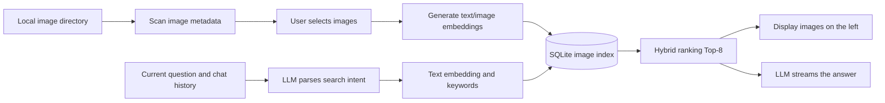

<div align="center">
    
    <div>
        <a href="README.md" target="_blank">中文</a> |
        <a href="README_EN.md" target="_blank">English</a>
    </div>
    <br />
    <div>
        
        
        
        <br>
        
    </div>
    <h1 style="margin: 10px">
        <a href="https://github.com/Kydon-ai/IMGM" target="_blank">IMGM</a>
    </h1>
    <p>A general-purpose desktop image management tool</p>
</div>

# 1. Project Motivation ⛵

There are more and more social media platforms and messaging apps. Besides QQ, users may also collect stickers and images in WeChat, Douyin, Xiaohongshu, and many other platforms. Each platform has its own collection. If you want to use a sticker from platform B on platform A, you usually have to switch between several applications to find and save it repeatedly.

IMGM is designed to keep image assets on your own computer, then help you find them quickly through directory scanning, filename search, and AI semantic search. Images can be copied directly to the system clipboard, reducing the time spent searching across platforms without uploading your local image library to a third-party service.

IMGM currently supports two independent use cases:

- **Local image library**: Scan local directories, perform fuzzy filename searches, browse results page by page, and copy images. You can also configure an LLM API to activate the AI assistant, which performs hybrid retrieval using text and visual embeddings generated from your local images.
- **Remote RIR**: Read a remote JavaScript image manifest provided by the user, then browse and copy remote images. RIR does not use the local image library's list or cache.


## 1.1 Data and Privacy

- Image scanning and image embedding generation are performed locally. Embeddings are compared locally, and image files are not uploaded to the LLM provider.
- The SQLite database, image directories, and model cache are stored locally in `data/` by default.
- During AI retrieval, the current user question and the necessary chat history are sent to the configured LLM provider to parse search intent and organize the answer.

# 2. Technology Stack 🛠

IMGM is a desktop application built with Electron. Its main technologies are:

| Technology | Purpose |
| --- | --- |
| Electron 33.0.2 | Desktop windows, the main process, and system capabilities |
| TypeScript | Main process, preload scripts, DOM logic, and AI modules |
| Native HTML/CSS/DOM | UI structure and interaction without a large frontend framework |
| `electron-store` | Store local UI state, RIR data, search history, and settings |
| `better-sqlite3` | Store image indexes and embeddings, and provide local retrieval |
| Transformers.js | Run text, image, and Chinese tokenization models |
| LangChain / LangGraph | Orchestrate the AI image retrieval workflow |
| DeepSeek or an OpenAI-compatible API | Parse user intent and generate chat responses |
| electron-builder | Generate Windows, Linux, and macOS release packages |

The source code is located in `src/` and is compiled to `dist/` with TypeScript before it runs. Release packages are built with `electron-builder`.

Development and CI use Node.js 22 or later. Because dependencies such as `better-sqlite3` and `sharp` contain native modules, the project checks or rebuilds them during startup, testing, and CI packaging so that they match Electron's ABI version.

# 3. Run Locally 👉

## 3.1 Requirements

**For end users**

If you only want to use the application, prepare the following:

1. Windows or Linux.
2. Some image assets for testing. If you do not want to rename images manually, you can use the [Image Semantic Renamer skill](https://skillhub.cn/skills/user_7c408d5e/image-semantic-renamer) to let your agent rename assets automatically and improve retrieval quality.
3. A working LLM API configuration if you want to use the AI features.

> End users can go directly to the [Releases page](https://github.com/Kydon-ai/IMGM/releases) to download the latest installer.

**For developers**

If you are developing the project, you also need:

1. Git.
2. Node.js 22 or later, with `node` and `npm` available in your terminal.

## 3.2 Clone the Project and Install Dependencies

Clone the project:

```bash
git clone https://github.com/Kydon-ai/IMGM.git
cd IMGM
```

Install the locked dependency versions:

```bash
npm ci
```

For everyday development, you can also use:

```bash
npm install
```

## 3.3 Configure Environment Variables

Copy the example configuration file:

Windows PowerShell:

```powershell
Copy-Item .env.example .env
```

macOS/Linux:

```bash
cp .env.example .env
```

Common `.env` settings:

| Setting | Default | Purpose |
| --- | --- | --- |
| `DEEPSEEK_API_KEY` | Empty | DeepSeek API key for CLI/MCP; it must be entered in Settings |
| `DEEPSEEK_MODEL_NAME` | `deepseek-chat` | Default chat model |
| `DEEPSEEK_BASE_URL` | `https://api.deepseek.com` | LLM API base URL |
| `IMAGE_DB_PATH` | `./data/app.db` | SQLite database path for image indexes |
| `IMAGE_MODEL_CACHE_DIR` | `./data/models` | Transformers.js model cache directory |
| `TEXT_MODEL_ID` | `aurantium/clip-ViT-B-32-multilingual-v1` | Text embedding model |
| `IMAGE_MODEL_ID` | `Xenova/clip-vit-base-patch32` | Image vision embedding model |
| `IMAGE_DATASET_PATH` | `./data/dataset/images.jsonl` | Image dataset metadata path |

LLM settings for the desktop app should normally be configured through Settings. `.env` is mainly used by CLI tools, the MCP Server, or runtime scenarios without the UI settings. Apart from `DEEPSEEK_API_KEY`, most users do not need to edit the other values.

## 3.4 Prepare the AI Models

When running from source, AI retrieval uses local models. After installing dependencies, run:

```bash
npm run models:download
```

This command downloads:

- The CLIP text model, which converts user queries into text embeddings;
- The CLIP image model, which generates visual embeddings for images;
- The Chinese tokenization model, which extracts keywords from image names and queries.

Models are downloaded to `data/models` by default. At runtime, local files are preferred, so models are not downloaded temporarily every time a chat message is sent.

If you change `TEXT_MODEL_ID`, `IMAGE_MODEL_ID`, or the model cache directory, download the models again and rebuild the image index with the corresponding models.

> Official release packages include the models in the installer's `resources/models` directory.

## 3.5 Start the Project

Start the project:

```bash
npm start
```

Run tests:

```bash
npm test
```

# 4. Core Modules 🤓

## 4.1 Image Library Interface

The left menu contains **Image Library** and **Remote RIR**, while **Settings** is in the lower-right corner. The image library and RIR use separate data lists, so switching modules does not overwrite one another.


The basic image library workflow is:

1. Start the application.
2. Open **Settings** in the lower-left corner. In **LLM Settings**, add a provider and enter its API URL, model, and API key.


3. Click **Test Connection**. You can use the provider after the test succeeds.
4. Return to **Image Library**, click **Choose Folder**, and select a directory containing image assets.
5. Click **Search Images** to confirm that the images can be scanned and browsed.
6. Click **Index Images**, browse the directory list, select the images to include in AI retrieval, and click **Apply**.
7. Wait for the indexing progress in the lower-right corner after the dialog closes. The speed depends on your machine.
8. Enter a natural-language query in the AI Image Assistant on the right.

The standard image library scan supports `.jpg`, `.jpeg`, `.png`, and `.gif`. Image indexing also supports `.webp` and `.bmp`. The library displays 8 images per page.

## 4.2 Image Library Search History


Results from directory scans and AI searches are stored in the same search history:

- Each new result is appended to the end of the list.
- The current pointer records the result being viewed.
- The left arrow on the right side of the path row shows the previous result.
- The right arrow shows the next result.
- Clicking **Refresh** first jumps to the most recent directory scan result.
- AI results are marked as AI-sourced and appended to the end of the history without overwriting directory scan results.
- The history limit can be adjusted under **Settings → Image Library Configuration**, from 1 to 500.

## 4.3 Image Index Management

Image index management determines which images can be found by AI retrieval. The workflow is:


1. Select a valid local folder.
2. Click **Index Images** in the toolbar.
3. The dialog lists scanned images grouped by directory path.
4. Each directory is collapsed by default. Click its title to expand or collapse it.
5. Click the checkbox before a directory to select or clear all images in that directory.
6. Each image entry contains a checkbox, the filename including its extension, and a preview.
7. Images already present in the database remain selected by default.
8. After clicking **Apply**, the program diffs the current selection against the previous database state:
   - Newly selected images generate image and name embeddings.
   - Cleared images are removed from the image index.
   - Unchanged images are not processed again.
9. After the task is submitted, the dialog closes and the lower-right corner shows the progress, percentage, and current filename.


10. Once the task is complete, the new images can be found by the AI Image Assistant.

> Avoid deleting or moving images while they are being indexed.

# 4. Remote Image Retrieval (RIR)

RIR (Remote Image Retrieval) is a convention for remote image resources. It is intended to support future extensions that read images from remote sources. An RIR server exposes a JavaScript module containing a list of relative image paths and the root URL of the image resources. IMGM reads this module and lets you browse and copy remote images page by page on the desktop.


RIR is fully independent from the local image library history:

- It uses separate RIR path and image lists.
- It uses separate pagination state and cache.
- RIR displays 12 images per page.
- RIR does not write remote images into the local image library's SQLite index.
- Switching to the local image library does not clear RIR results, and vice versa.

> More RIR features will be added in the future.

## 4.1 Basic RIR Usage

1. Click **Remote RIR** on the left.
2. Enter the URL of the remote JavaScript manifest in the RIR input field.
3. Click the parse button.
4. After parsing succeeds, the images appear in the RIR image area.
5. Use the RIR search box to perform a fuzzy search by remote filename.
6. Use the refresh and pagination buttons to browse the images.
7. Click an image's copy button to copy the remote image to the clipboard.

The URL should directly return the contents of an RIR module. For example:

```text
https://www.qidong.tech:5173/resource/pic/image_list.js
```

## 4.2 RIR File Format

An RIR file must ultimately export the following structure:

```javascript
const rir_result = {
  target: "https://www.example.com/resource/pic/",
  list: [
    "cat/cat-001.png",
    "cat/cat-002.gif",
    "dog/dog-001.jpg"
  ]
};

export default rir_result;
```

`target` is the root URL for the remote images and should preferably end with `/`. `list` contains image paths relative to `target`. IMGM joins the two values to create the final URL:

```text
https://www.example.com/resource/pic/ + cat/cat-001.png
```

Filenames in the list may contain subdirectories. The program reads them in list order and paginates them in the UI.

## 4.3 Generate an RIR File with Python

Run the following Python script in the resource root directory to recursively scan images and generate `image_list.js`:

```python
import os
import json

def scan_images_recursive(folder_path, output_js_file="image_list.js"):
    """
    Recursively scan image files in a folder and its subfolders, then generate a JS list.
    :param folder_path: Root directory to scan
    :param output_js_file: Output JS filename (default: image_list.js)
    """
    image_extensions = ('.jpg', '.jpeg', '.png', '.gif', '.webp', '.bmp')
    image_files = []

    for root, _, files in os.walk(folder_path):
        for filename in files:
            if filename.lower().endswith(image_extensions):
                relative_path = os.path.relpath(
                    os.path.join(root, filename),
                    folder_path,
                )
                relative_path = relative_path.replace("\\", "/")
                image_files.append(relative_path)

    image_files.sort()
    result = {
        'list': image_files,
        'target': "https://www.example.com/resource/pic/",
    }

    js_code = (
        f"const rir_result = {json.dumps(result, indent=2, ensure_ascii=False)};\n"
        "export default rir_result;"
    )

    with open(output_js_file, "w", encoding="utf-8") as f:
        f.write(js_code)

    print(f"Generated {output_js_file} with {len(result['list'])} images.")


if __name__ == "__main__":
    folder_to_scan = "./"
    scan_images_recursive(folder_to_scan)
```

Deployment steps:

1. Place the script in the remote resource root directory.
2. Change `folder_to_scan` to the directory that should be scanned.
3. Change `result['target']` to the root URL of the remote image resources.
4. Run the script to generate `image_list.js`.
5. Use Nginx, a static file server, or another web server to serve both `image_list.js` and the image resources.
6. Enter the generated `image_list.js` URL in IMGM's RIR input field.

You can also rename the exported variable manually, but keeping `export default rir_result` is recommended so that IMGM can parse the file directly.

# 5. AI Image RAG Retrieval

The AI Image Assistant is located on the right side of the main interface. It follows the workflow **parse intent → local retrieval → organize the answer**.



## 5.1 Starting an AI Retrieval

AI retrieval requires usable local models and an image index first:

1. Run `npm run models:download`, or use a release installer that already includes the models.
2. Select an image directory in the image library.
3. Click **Index Images**.
4. Select the images to include in AI retrieval and click **Apply**.
5. Wait for the image embedding task to finish.
6. Open Settings, then configure and test an LLM provider.
7. Activate one valid LLM configuration.
8. Enter a natural-language question in the chat box.

Running **Search Images** alone does not generate image embeddings or automatically add images to the AI index.

## 5.2 LLM Settings

Open **Settings** in the lower-left corner and enter **LLM Settings**:

1. Click **Add Provider**.
2. Choose OpenAI, DeepSeek, Qwen, or a custom template.
3. Enter the provider name, API URL, model name, and API key.
4. Click **Test Connection**.
5. Select and activate a valid configuration.
6. Click **Save**. The Settings window closes automatically.

The application sends requests using the OpenAI-compatible Chat Completions API. The API URL is ultimately joined with `/chat/completions`. A custom provider generally needs to support:

- `POST /chat/completions`;
- SSE streaming responses with `stream: true`;
- `response_format: {"type": "json_object"}` for parsing image search intent;
- Standard `choices[0].message.content` and streaming `choices[0].delta.content` response structures.

If a proxy platform does not support JSON Object mode, enable its corresponding compatibility option or use an API that supports the parameter. Otherwise, intent parsing may fail. When parsing fails, the program continues image search using the user's original question.

## 5.3 How the LLM Parses Queries

The model converts the user's question into a JSON intent with fields such as:

```json
{
  "shouldSearch": true,
  "query": "yellow cat meme",
  "category": null,
  "color": "yellow",
  "animated": null,
  "transparent": null
}
```

The model combines recent chat history to handle conditions distributed across multiple turns. For example:

```text
User: I want to find a picture of a cat.
User: Preferably a yellow one.
User: It should be animated.
```

The final search tries to combine these conditions into **yellow animated cat** instead of using only the last sentence, **It should be animated**. Normal conversation may return `shouldSearch: false`; image requests such as **find**, **do you have**, or **search** should return `shouldSearch: true`.

Categories and colors are natural-language query conditions supplied by the model. They do not depend on a category knowledge table hard-coded in the project. Whether an image matches is ultimately determined by the local index and similarity ranking.

## 5.4 Hybrid Retrieval

For every indexed image, IMGM stores the image-name embedding, visual embedding, and basic metadata. When a user searches, the system calculates:

- Similarity between the text query and the image-name embedding;
- Similarity between the text query and the image visual embedding;
- A keyword matching score between the tokenized query and the image name.

The system combines these component scores into a final ranking score and returns the 8 most relevant images. Name embeddings help match the semantics of filenames, visual embeddings help match image content, and keyword scores help preserve explicit words in filenames.

Therefore, images must be indexed first, and fields such as `image_embedding` and `name_embedding` must be valid for AI retrieval to work fully.

## 5.5 Models and Vector Indexes

Default models:

```text
TEXT_MODEL_ID=aurantium/clip-ViT-B-32-multilingual-v1
IMAGE_MODEL_ID=Xenova/clip-vit-base-patch32
```

After changing the models, download them again and rebuild the image index:

```bash
npm run models:download
npm run images:reindex -- "path/to/data/app.db"
```

For a first-time image library setup, use the indexing dialog. The CLI import command is suitable for processing a large number of images in batches:

```bash
npm run images:import -- "D:\Pictures" "D:\data\app.db"
```

If you use an existing database from a reference project, set `IMAGE_DB_PATH` to that project's `data/app.db`. If you use your own empty database, the program creates the schema automatically, but you must import or index images first.

## 5.6 Generate and Index a Dataset

To build an image metadata dataset, run:

```bash
# Use the default directories
npm run dataset:prepare

# Use a custom image directory and output directory
npm run dataset:prepare -- "D:\Pictures" "data\dataset"
```

Metadata may include:

- Filename and relative path;
- Image format, dimensions, and composition orientation;
- Whether the image is animated;
- Whether the image is transparent;
- Dominant color and its hexadecimal value;
- Tags, descriptions, and search text;
- Training split, test split, and data status.

# 6. MCP Image Retrieval Service

IMGM also provides an stdio-based MCP Server that exposes SQLite image retrieval to Claude Desktop, Cursor, or other MCP clients. The MCP Server does not generate chat answers; it only returns image retrieval results for a query.

MCP uses the same hybrid retrieval approach, combining CLIP text/image embeddings with Chinese keyword matching. Returned content includes:

- Image file path;
- Filename;
- Category, tags, and description;
- A `file://` image URL;
- The total score and component scores for name, image, embedding, and keywords.

## 6.1 Start MCP

Configure the database path in `.env`, then run:

```bash
npm run mcp:build
npm run mcp
```

For example:

```env
IMAGE_DB_PATH=D:/project/IMAGE-SEARCH-TEST/data/app.db
IMAGE_MODEL_CACHE_DIR=D:/project/IMAGE-SEARCH-TEST/data/models
```

Example MCP client configuration:

```json
{
  "mcpServers": {
    "imgm-image-search": {
      "command": "node",
      "args": ["D:\\IMGM\\dist\\mcp\\server.js"],
      "cwd": "D:\\IMGM"
    }
  }
}
```

MCP provides the `search_images` tool:

| Parameter | Type | Description |
| --- | --- | --- |
| `query` | string | Required natural-language search query |
| `limit` | number | Number of results, from 1 to 50; default 8 |
| `category` | string | Optional explicit category filter |

The MCP process uses local models to calculate embeddings. Before starting it, make sure the model cache directory and the embeddings in the database are available.

# 7. Common Commands 🕮

| Command | Purpose |
| --- | --- |
| `npm ci` | Install dependencies using the lockfile |
| `npm run build` | Compile TypeScript to `dist/` |
| `npm start` | Compile and start the Electron application |
| `npm test` | Compile and run tests |
| `npm run models:download` | Download the text, image, and Chinese tokenization models |
| `npm run dataset:prepare` | Scan images and generate a metadata dataset |
| `npm run images:import -- <image-directory> [database-path]` | Import images in batches and generate embeddings |
| `npm run images:reindex -- [database-path]` | Regenerate embeddings for existing image records |
| `npm run eval:retrieval` | Run retrieval evaluation |
| `npm run mcp:build` | Compile the MCP Server |
| `npm run mcp` | Start the MCP Server |
| `npm run make:win` | Generate a Windows installer |
| `npm run make:linux` | Generate Linux deb and rpm packages |
| `npm run make` | Generate Windows and Linux packages |

# 8. Project Directory Structure 🕮

The main project directories and files are organized as follows:

```text
IMGM/
├── index.html                         # Desktop page structure, styles, and mount script
├── src/
│   ├── main.ts                        # Electron main process, windows, settings, clipboard, and IPC
│   ├── preload.ts                     # Exposes safe Electron capabilities to the renderer
│   ├── dom.ts                         # Image library, RIR, indexing dialog, settings, and shortcut interaction
│   ├── ai-chat.ts                     # AI chat UI, streaming events, and search result playback
│   ├── ai/
│   │   ├── rag-workflow.ts            # LLM intent parsing, image retrieval, and answer orchestration
│   │   ├── image-indexer.ts           # Image scanning, index-state diffing, and embedding jobs
│   │   └── deepseek-client.ts         # OpenAI-compatible chat API, JSON, and SSE parsing
│   ├── mcp/
│   │   ├── sqlite-image-store.ts      # SQLite image database, vector calculation, and hybrid ranking
│   │   └── server.ts                  # MCP Server entry point and `search_images` tool
│   └── cli/
│       ├── download-models.ts         # Download local models in advance
│       ├── import-images-to-db.ts     # Import images in batches and generate indexes
│       └── rebuild-image-index.ts     # Rebuild embeddings for existing images
├── electron-builder.yml               # Windows, Linux, macOS packaging and model resource configuration
├── .github/
│   └── workflows/
│       ├── ci.yml                     # Automated compilation, native-module fixes, and tests
│       └── release.yml                # Automated model download, cross-platform packaging, and Release publishing
├── data/                              # Local database, models, and datasets; not committed to Git
└── review/                            # Development issue retrospectives and solution records
```

The directory tree can be understood by responsibility:

- `src/`: application source code; `ai/` handles AI retrieval, `mcp/` handles the image database and MCP service, and `cli/` handles command-line tasks.
- `.github/workflows/`: continuous integration and Release automation.
- `data/`: runtime-generated local data; `review/`: development notes and issue retrospectives.

# 9. Troubleshooting 📝

## 9.1 AI Reports That the Database Does Not Exist

Under normal conditions, the program creates an empty database automatically. If the database path is incorrect, check:

1. Whether `IMAGE_DB_PATH` points to the wrong path;
2. Whether the database parent directory is readable and writable;
3. Whether a reference project's database path was configured to a file that does not exist;
4. Whether the database contains an `images` table.

An automatically created database contains only the schema and no image data. Import images through the image indexing dialog or `images:import`.

## 9.2 `tokenizer_class` or Model Loading Failure

This usually means that the runtime cannot find the local model files. Run:

```bash
npm run models:download
```

Also check that `IMAGE_MODEL_CACHE_DIR` matches the download directory. Release builds should use `resources/models` inside the installer. If you changed `TEXT_MODEL_ID` or `IMAGE_MODEL_ID`, download the corresponding models and rebuild the index.

## 9.3 `better-sqlite3` ABI Mismatch

If you see `compiled against a different Node.js version` or a `NODE_MODULE_VERSION` error, the native module was compiled for Node.js but is currently being loaded by Electron. Run:

```bash
npm run rebuild:electron
```

Then restart the application. The project's tests and CI also rebuild the module automatically for the Electron version.

## 9.4 RIR Parsing Failure

Check the following:

- The input is the complete URL of an `image_list.js` module;
- The URL can be opened directly in a browser;
- The server returns a JavaScript module, not an HTML error page;
- Joining `target` and `list` produces real image URLs;
- The custom domain is allowed by the application's Content Security Policy;
- The remote server does not impose cross-origin, hotlink-protection, or login restrictions.

## 9.5 Failed to Copy a Remote Image

First confirm that the remote URL returns an actual image and that the response is not redirected to a login page. Some sites return different content based on request headers, referrers, or cookies. In such cases, the fact that an image displays in a browser does not guarantee that the desktop application can read it. Animated-image copying also requires the file-clipboard compatibility method on Windows; support for animated-image clipboards on other platforms depends on the target application.

## 9.6 Garbled Chinese Text in PowerShell

If the terminal displays garbled text, run the following in the current PowerShell session:

```powershell
chcp 65001
```

To apply this automatically whenever PowerShell starts, edit the PowerShell profile:

```powershell
notepad $PROFILE
```

Add:

```powershell
chcp 65001 > $null
[Console]::InputEncoding = [System.Text.UTF8Encoding]::new()
[Console]::OutputEncoding = [System.Text.UTF8Encoding]::new()
```

Save the file and reopen the terminal. If PowerShell asks whether to create the profile file, confirm.

# 10. References 📚

Environment setup:<br>
https://blog.csdn.net/C_hawthorn/article/details/136072703<br>
https://blog.csdn.net/qq_38463737/article/details/140277803<br>

Reference articles:<br>
https://blog.csdn.net/qq_37779709/article/details/81633502<br>

Beginner guide:<br>
https://blog.csdn.net/weixin_50216991/article/details/124188494<br>

Packaging guide:<br>
https://blog.csdn.net/ZYS10000/article/details/134913618<br>

If you find a problem, please open an Issue with your operating system, project version, terminal logs, and reproduction steps. Do not include API keys, personal image paths, or personal database files in Issues or logs.
